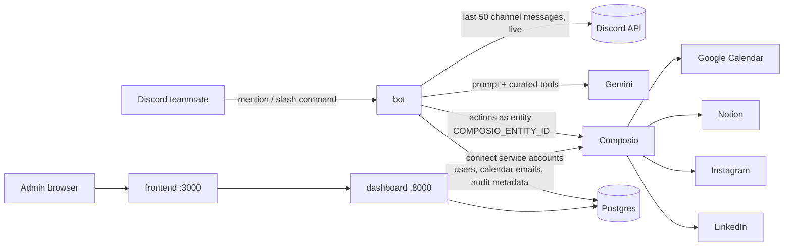

# Dobby architecture

Dobby is three deployable pieces sharing one Postgres database, all started by `compose.yaml`:

| Piece | Runtime | Doc |
| --- | --- | --- |
| `bot/` | Python 3.12, discord.py + Gemini + Composio | [docs/BOT_ARCHITECTURE.md](docs/BOT_ARCHITECTURE.md) |
| `dashboard/` | FastAPI on uvicorn, port 8000 | [docs/DASHBOARD_ARCHITECTURE.md](docs/DASHBOARD_ARCHITECTURE.md) |
| `frontend/` | Next.js 15, port 3000 | [docs/FRONTEND_ARCHITECTURE.md](docs/FRONTEND_ARCHITECTURE.md) |

## Runtime

Five Compose services: `postgres`, `migrate` (Alembic, runs once), `bot`, `dashboard`, `frontend`. The bot publishes no ports, runs non-root with all capabilities dropped, a read-only filesystem, a 16 MB `/tmp`, bounded logs and a 512 MB memory cap. The dashboard and frontend publish 8000 and 3000 on the host. All configuration is environment variables from a local `.env` (never baked into images); `bot/config.py` validates the bot's and `docker compose config` the rest.

The root `Dockerfile` has stages `base` (dependencies + `bot/`), `migrate`, `test` (adds `tests/`, `scripts/`, `pyproject.toml`) and `runtime` (last, so a bare `docker build .` selects it; `publish.yml` pins it). The dashboard and frontend have their own Dockerfiles.

## Source structure

| Path | Responsibility |
| --- | --- |
| `bot/main.py` | Entrypoint: load config, `--check`, start the Discord client |
| `bot/config.py` | Frozen `Config` from env/dotenv; allowlists, timezone, `CONTEXT_MESSAGE_LIMIT`, `COMPOSIO_ENTITY_ID`, service IDs |
| `bot/agent.py` | Generic Gemini tool-calling loop over a registry; returns text plus any confirm-gated `PendingAction`s |
| `bot/composio.py` | Curated Composio action schemas → Gemini declarations; execution under the service entity, off the event loop |
| `bot/memory.py` | Postgres: users by Discord ID/name, calendar emails, `agent_actions` metadata rows |
| `bot/integrations/base.py` | `Integration`, `LocalTool`, `PendingAction`, `RunContext` |
| `bot/integrations/discord/` | The transport: client (gating, cooldown, mentions), live channel context, `/email` + `/help`, the Confirm/Cancel view |
| `bot/integrations/google_calendar/`, `notion/`, `instagram/`, `linkedin/` | One folder per service: Composio actions Gemini may call, local tools, slash commands, prompt guidance, publish helpers |
| `bot/voice.py`, `bot/responses/` | Dobby's phrasings, 20 per situation |
| `dashboard/` | Login (Google/Discord OAuth and/or local LAN accounts), user roster and calendar emails, admin-only service-account connections, audit log |
| `frontend/` | The web UI for the above |
| `migrations/` | Alembic schema (`001_initial`, `002_merge_contacts_service_integrations`) |
| `scripts/bootstrap.py` | Create `.env` before the first run; repair a Docker-created directory |
| `scripts/check_secrets.py` | CI guard against committed credentials |
| `scripts/update-pi.sh`, `deploy/` | Optional Pi pull-and-recreate timer for the published bot image |
| `compose.yaml`, `compose.registry.yaml`, `compose.test.yaml` | Runtime, published-image override for `bot`, offline tests/lint |
| `.github/workflows/` | PR checks (`ci.yml`) and main-only bot image publication (`publish.yml`) |

## Request lifecycle (summary)

1. **Gate.** Reject other servers, users/roles outside the allowlist and disallowed channels before calling anything. 10-second per-user cooldown. No admin bypass.
2. **Context.** Read the last `CONTEXT_MESSAGE_LIMIT` human messages from the channel via the Discord API; resolve `@mentions` to registered users. Discard afterwards.
3. **Agent.** Gemini receives the persona, every integration's guidance, the context block (marked untrusted), the request and the mentioned people. It may call curated Composio actions (calendar, Notion) or local tools. Publishing tools only *queue* a `PendingAction`.
4. **Result.** The reply is edited into the channel. Queued actions are shown as a preview with Confirm/Cancel (requester-only, 2 minutes); Confirm runs them. Every tool call and publish is recorded in `agent_actions` as metadata only.

Details: [docs/BOT_ARCHITECTURE.md](docs/BOT_ARCHITECTURE.md).

## Secrets and trust boundaries

- **`.env`** holds the Discord token, Gemini and Composio keys, optional dashboard OAuth client secrets, the cookie secret and the Postgres password. Compose passes them as environment; Git and Docker builds ignore the file. Dotenv interpolation is off; explicit process environment wins.
- **Composio** holds the OAuth tokens for Google Calendar, Notion, Instagram and LinkedIn under one entity (`COMPOSIO_ENTITY_ID`). Dobby never sees provider tokens; revoking in Composio cuts it off. Only dashboard admins can connect or disconnect.
- **Postgres** holds people (names, Google emails and local credential hashes, Discord IDs, calendar emails), dashboard sessions, which providers are connected, and tool-call metadata. No message content, tool arguments or results are stored.
- **Discord allowlists** delegate the connected accounts' capabilities to a role: anyone with it can create events, write Notion pages and — after their own Confirm — publish to the group's social accounts, all as Dobby. Restrict the role.
- The dashboard signs sessions with `SECRET_KEY`; login supports OAuth and/or LAN username/password accounts (`AUTH_MODE`), restricted to pre-registered users (verified Google accounts from any domain, known Discord IDs, or administrator-created local usernames). `PATCH /me` lets a user change only their own calendar email. Local credentials are salted scrypt hashes in Postgres (migration 003), created/reset with `python -m dashboard.local_admin USERNAME`. Local login and sessions require a private/loopback client address; host firewall restrictions remain necessary with Docker or proxies. See [dashboard setup](README.md#step-5-dashboard-login).
- Logs carry Discord actor/guild IDs and tool names, never prompts, message text or credentials. Free-tier Gemini may use data for product improvement.

## Image delivery and updates

Main pushes verify code and publish AMD64/ARM64 bot images with GitHub's built-in token. The optional Pi timer pulls before replacing, uses `flock`, never pulls Git, and only touches the `bot` service; the dashboard, frontend and migrations change through a deliberate checkout update and `docker compose up -d --build`. Updates briefly reconnect Discord and discard pending Confirm previews.

## Persistence and operating limits

One bot instance per Discord token: cooldowns and Confirm views are process-local. Google Calendar remains the event store. The bot writes only `agent_actions`; users and their emails come from the dashboard. Composio action names are checked at startup (`composio_action_unknown`), not at build time. Instagram publishing needs a Business/Creator account and public image URLs; a story featuring a post cannot carry the share sticker. Gemini and provider quotas apply regardless of where Dobby is hosted.

## Verification

Mocked tests cover gating and cooldowns, live-context gathering and mention resolution, the agent loop and local-tool dispatch, Composio schema conversion, the registry, the Confirm gate (requester-only, execute on Confirm only, cancel/timeout), each integration's publish flows, and every response pool. CI runs ruff, the suite, Compose validation and the Docker build, then the suite again inside the `test` image with networking disabled. `python -m bot.main --check` validates settings offline. Live Discord/Composio testing needs the owner's credentials; the deployment guide has the smoke test.
