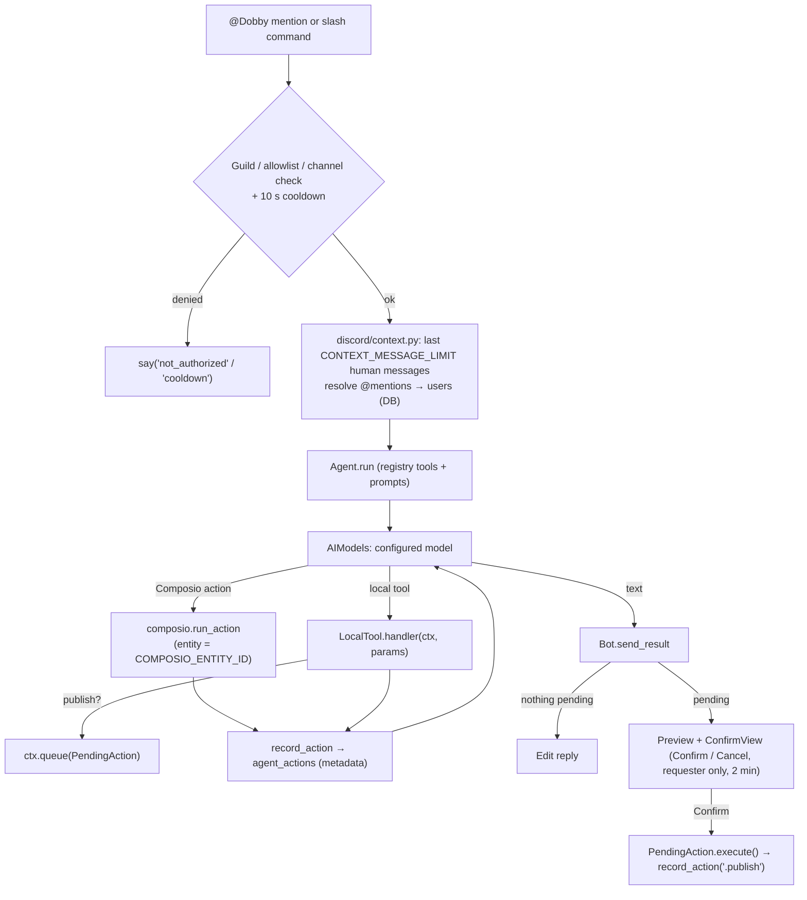

# Dobby bot architecture

Dobby is a Discord bot for a single guild that turns natural-language requests into actions on
Google Calendar, Notion, Instagram and LinkedIn. A configurable AI model drives a tool-calling loop; each
service lives in its own folder under `bot/integrations/` and declares what the model may do with it.
Nothing conversational is stored: each request reads recent channel messages live, and only
tool-call metadata is recorded (to `agent_actions`). Anything published to the outside world
(Instagram, LinkedIn) is previewed in Discord and waits for the requester to press **Confirm**.
Calendar writes use the meeting proposal and 🟢 / 🔴 reaction flow restored from `b79b732`
(the parent of Avi Agola's `4182a50` reconstruction).
Missing invitee emails do not block that proposal or event creation. Confirmation also approves
the specific deferred invitations listed in the preview.

The dashboard (`dashboard/`) and frontend (`frontend/`) are documented separately. The bot talks
to them only through the shared Postgres database and the shared Composio entity. Dashboard `AUTH_MODE` (`oauth`, `local`, `both`) does not change Discord bot allowlists or Composio service authorization. Local usernames/password hashes belong to the dashboard; the bot does not authenticate with them. A local admin needs a registered Discord ID to use bot features that look up the user roster. See [dashboard login setup](../README.md#step-5-dashboard-login).

## Layout

```
bot/
├── main.py            entrypoint: logging, Config.load(), --check, Bot(config).run()
├── config.py          frozen Config from env/.env; allowlists, timezone, CONTEXT_MESSAGE_LIMIT, ids
├── AIModels.py        provider config, adapters, message/tool formats and per-request fallback
├── agent.py           provider-independent loop over a ToolRegistry → AgentResult(text, pending)
├── composio.py        curated action schemas → model tool declarations; execute under COMPOSIO_ENTITY_ID
├── memory.py          Postgres: users by Discord ID / name, calendar emails, agent_actions audit rows
├── db.py, models.py, voice.py, responses/   session factory; errors + email helpers; Dobby's phrasings
└── integrations/
    ├── __init__.py    INTEGRATIONS tuple + build_registry(toolset) → ToolRegistry
    ├── base.py        Integration, LocalTool, PendingAction, RunContext
    ├── discord/       the transport: client.py (Bot), context.py, commands.py (/email, /help), confirm.py
    ├── google_calendar/   __init__ (ACTIONS, prompt), commands.py (/schedule, /events), tools.py
    ├── notion/            __init__ (ACTIONS, prompt), commands.py (/notion search|note)
    ├── instagram/         __init__, commands.py (/instagram posts|post|story), publish.py
    └── linkedin/          __init__, commands.py (/linkedin post), publish.py
```

Tests mirror this under `tests/` and `tests/integrations/<service>/`.

## What an integration is

`bot/integrations/base.py`:

| Type | Meaning |
| --- | --- |
| `Integration` | `key`, `label`, Composio `app`, curated `actions` the model may call directly, `local_tools`, a `prompt` paragraph, `register_commands(bot)`, `help_lines` |
| `LocalTool` | An `AIModels.FunctionDeclaration` plus an async handler that runs in-process (`(RunContext, params) -> dict`) |
| `PendingAction` | Something that must not happen until the requester confirms: `integration`, `label`, `preview`, and an async `execute()` |
| `RunContext` | Per-run state a handler may use: DB session, guild/channel/user ids, the Composio toolset, `Config`, and `pending` — `ctx.queue(action)` parks a `PendingAction` and tells the model it is awaiting confirmation |

`build_registry()` walks `INTEGRATIONS`, asks Composio for the schema of every curated action
(`composio.declarations_for`, which preserves JSON Schema and skips
unknown names with a warning), adds the local tools, and joins the prompts.

| Folder | Composio actions the model calls directly | Local tools | Commands | Confirm-gated? |
| --- | --- | --- | --- | --- |
| `google_calendar` | find event, find free slots | `lookup_calendar_email`; schema-preserving create / patch / delete proposal handlers | `/schedule`, `/events` | **yes**, 🟢 / 🔴 |
| `notion` | search, fetch, create page, add content | — | `/notion search`, `/notion note` | no |
| `instagram` | none | `list_instagram_posts`, `draft_instagram_post`, `draft_instagram_story` | `/instagram posts`, `post`, `story` | **yes** |
| `linkedin` | none | `draft_linkedin_post` | `/linkedin post` | **yes** |

Publishing integrations expose no direct Composio actions: the model can only *draft*, and the Graph
API / LinkedIn calls run inside `PendingAction.execute()` after Confirm.

Calendar schemas still come from Composio, but `build_registry()` installs local handlers for
all three calendar write tools. `google_calendar/proposals.py` reads the existing event for
edits/deletions, freezes the write arguments, and queues the original bold-labelled preview:
Title, When (with UTC offset), Location, Description, Invitees, and actual Changes for edits.
Updates use `GOOGLECALENDAR_PATCH_EVENT` so omitted fields are preserved. The adapter reads
with `GOOGLECALENDAR_EVENTS_GET` again before applying an edit/deletion and rejects a changed
snapshot. This is a best-effort stale-preview check, not an atomic conditional write.
Only single timed meetings are supported. Additional write options are included in the preview.

`discord/calendar_confirm.py` presents these proposals for both `/schedule` and mentions,
using the original response pools under `calendar_*`. It adds 🟢 to confirm and 🔴 to cancel,
accepts only the requester's reaction, rechecks access, and expires after two minutes. A
proposal is claimed before awaiting anything, preventing duplicate reaction writes. Long
previews are split in full and reactions go on the last message. Missing reaction permission
leaves no executable proposal; the bot needs Add Reactions and Read Message History in the
channel. Manage Messages is optional (used to clear spent reactions). Pending proposals are
in memory and do not survive a restart. No live calendar mutations are needed to run tests.

## Request lifecycle



1. **Entry.** `discord/client.py`: `on_message` ignores bots, other guilds and non-mention channels,
   requires an actual mention, checks channel access and the allowlist, then edits a placeholder
   reply. Slash commands use `gate()` (allowlist + cooldown, then `defer`).
2. **Context.** `ask_agent()` pulls `config.context_limit` non-bot messages (excluding the trigger),
   rewrites `<@id>` to `@Display Name` and collects the registered people mentioned.
3. **Agent loop.** `agent.py` sends the context block (marked untrusted), then the request. The
   system prompt = persona + every integration's `prompt` + mentioned people. Function calls are
   dispatched by name: local tools run in-process, anything else the registry owns goes through
   Composio in a worker thread. Every call is recorded (tool name, ok/error, duration) and fed back.
   Stops on plain text, after 8 calls, or on a normalized `ModelError` after any configured fallback.
4. **Result.** `send_result()` edits the reply. If any `PendingAction`s were queued, the preview and a
   `ConfirmView` are attached. Confirm runs each action, records `<service>.publish`, and reports
   `published` / `publish_failed`; Cancel or a 2-minute timeout discards them. Other users' clicks
   are refused. Commands that publish directly (`/linkedin post`, `/instagram post|story`) skip the
   agent and call `bot.confirm(interaction, pending)` with the same view.
   If the pending batch includes a calendar action, the whole batch instead uses the reaction
   gate described above. Execution outcomes are audited separately from proposal preparation.

## Persistence, state and memory

### Email capture and deferred invitations

Authorized members can register their own calendar address without being pre-added by an admin:
`/email action:set email:me@example.com`, or `@Dobby my name is Leonard and my email is me@example.com`.
An explicit self-email declaration in an enabled channel also works without a mention. A direct
reply to Dobby's email prompt may contain just the address or `Leonard: me@example.com`.
These deterministic parsers save only the actual Discord author's row; they do not let the model
assign someone else's identity or modify roles and login credentials. `/email show` remains masked
and `/email remove` clears the address. All existing guild/channel/user/role checks still apply.

`google_calendar/tools.py` records missing lookups in the request. Calendar write schemas add a
local-only `deferred_invitees` list, stripped before Composio execution. Each entry includes a name
and, when known, a Discord ID. The preview asks for those addresses while proceeding with known
guests. Only a successful, confirmed event write creates durable `calendar_invites` rows tied to
the actual returned event ID. Cancelled/unconfirmed proposals never authorize a later invitation.

After an email save, a successful confirmed write with missing invitees, or a later agent request,
`google_calendar/invitations.py` retries waiting invitations. It rechecks the original requester's
access, resolves an exact Discord ID or an unambiguous exact/first name (never fuzzy), fetches the
current guest list, and patches it to add the missing address with notifications enabled. Existing
guest addresses are retained. PostgreSQL transaction advisory locks serialize Dobby's updates to
the same event; completed rows and existing-attendee checks suppress duplicates. Failed attempts
remain pending for the next trigger. Finished/cancelled events are not invited to. There is no
background polling loop; a later email save or request retries provider failures.

Before an agent request, `discord/emails.py` can recover explicit self-email declarations and
prompt replies from the same `CONTEXT_MESSAGE_LIMIT` human-message window in the current channel.
It respects `ALLOWED_CHANNEL_IDS` and `MENTION_CHANNEL_IDS`, and never stores chat text. Message
timestamps prevent older context from overwriting a newer address or undoing `/email remove`.
Apply migration **004** before running this bot version; it adds `calendar_invites` and
`users.calendar_email_updated_at`. Pending invitations survive restarts; unconfirmed previews do not.

All durable state lives in Postgres (Alembic migrations in `migrations/versions/`):

| Table | Bot usage |
| --- | --- |
| `users` | Read by `discord_id` (mentions, `/email show`) and by `display_name` (`lookup_calendar_email`); `/email set` and `remove` update `calendar_email` for the caller's own row |
| `calendar_invites` | Confirmed event IDs, requested people, original requester/channel, and pending/completed/expired status; no message content |
| `agent_actions` | Written: one row per tool call or publish, metadata only (`discord_id`, resolved `user_id`, tool name, `ok`/`error`, duration). Arguments and results are never stored |

`sessions` and `integrations` belong to the dashboard. Configuration is environment-only. There is
no conversation table; context is read from Discord and discarded. Cooldowns and pending confirms
are in-process, so run one bot instance per token.

**Composio identity:** every action runs as the single service entity `COMPOSIO_ENTITY_ID`
(default `dobby`), the same value the dashboard's admin-only Service accounts page connects.
Invitees only need a `calendar_email` on their `users` row; nobody links a personal account.

## Configuration

`Config.load()` reads the process env, then a dotenv file (`DOBBY_ENV_FILE`, default `.env`).

- **Required:** `DISCORD_TOKEN`, `DISCORD_GUILD_ID`, `COMPOSIO_API_KEY`, `DATABASE_URL`
- **Access:** `ALLOWED_USER_IDS`, `ALLOWED_ROLE_IDS` (at least one; default deny),
  `ALLOWED_CHANNEL_IDS`, `MENTION_CHANNEL_IDS` (empty means any channel)
- **Models:** `AI_PROVIDER`, `AI_MODEL`, `AI_API_KEY`, `AI_API_KEY_BACKUP`, `AI_MODEL_BACKUP`,
  `LOCAL_MODEL`, `AI_BASE_URL`. Cloud models require a key; local mode permits an empty key.
  Legacy `GEMINI_*` settings remain supported. See [model setup](../README.md#step-3-configure-an-ai-model).
- **Optional:** `TEAM_TIMEZONE`, `COMPOSIO_ENTITY_ID` (default `dobby`),
  `CONTEXT_MESSAGE_LIMIT` (0–500, default 50), `INSTAGRAM_USER_ID` (required to use Instagram;
  commands explain if missing), `NOTION_PARENT_PAGE_ID` (where `/notion note` creates pages)

Invalid config raises `ConfigError`, and the process exits with code 2.

## Adding or changing an integration

1. Create `bot/integrations/<service>/__init__.py` exporting `INTEGRATION = Integration(...)`.
   Put commands in `commands.py` (a `register(bot)` that adds commands or an `app_commands.Group`
   to `bot.tree`), local tools next to them, and anything that publishes in `publish.py` as
   `PendingAction` factories.
2. Add it to `INTEGRATIONS` in `bot/integrations/__init__.py`, and to `SUPPORTED_PROVIDERS` in
   `dashboard/routers/integrations.py` (a `{UI provider key: Composio toolkit slug}` map, the same
   slug as `Integration.app`) plus the card list in the frontend Integrations page.
3. **Verify action names.** Composio's catalog is only listable with an API key, so the `ACTIONS`
   tuples and the constants in `publish.py` are the expected names. Confirm them once with:
   `Composio(api_key=...).tools.get_raw_composio_tools(toolkits=["<toolkit-slug>"])`
   and print `.slug` / `.input_parameters`. Unknown names are logged at startup
   (`composio_action_unknown`) and skipped rather than crashing.
4. Add help lines and a prompt paragraph; add tests under `tests/integrations/<service>/`.

**Instagram notes.** Publishing is the Graph API's two-step container → publish flow and needs a
Business/Creator account (`INSTAGRAM_USER_ID`) connected through a Meta app with
`instagram_content_publish`. A story "featuring" one of our posts re-publishes that post's
image/video as a story; the API cannot attach the interactive share sticker, and carousel posts
have no single media URL to reuse. **LinkedIn** needs the `w_member_social` scope on the Composio
connection; the author URN is resolved from the connected account at publish time.

## Voice

User-facing system messages go through `voice.say(key, **fields)` (see `responses/`). Every file is
referenced by the Discord package; `tests/test_voice.py` requires 20 distinct lines each and that
`FALLBACK` has exactly the same keys.

## Running

- `python -m bot.main` (`--check` validates config and exits).
- Docker: root `Dockerfile` stage `runtime` (python:3.12-slim); in `compose.yaml` the `bot` service
  waits for `migrate` and a healthy `postgres`. Read-only container, no published ports.
- Discord permissions: Send Messages and **Read Message History** in mention channels (without the
  latter, requests still run but with no channel context).

The read-only Compose bot container sets `COMPOSIO_CACHE_DIR=/tmp/.composio`. The SDK creates the
directory the first time a tool returns a downloadable file, so it must be on the writable `/tmp`
tmpfs. This cache is disposable; it is not the persistent service-connection store.
